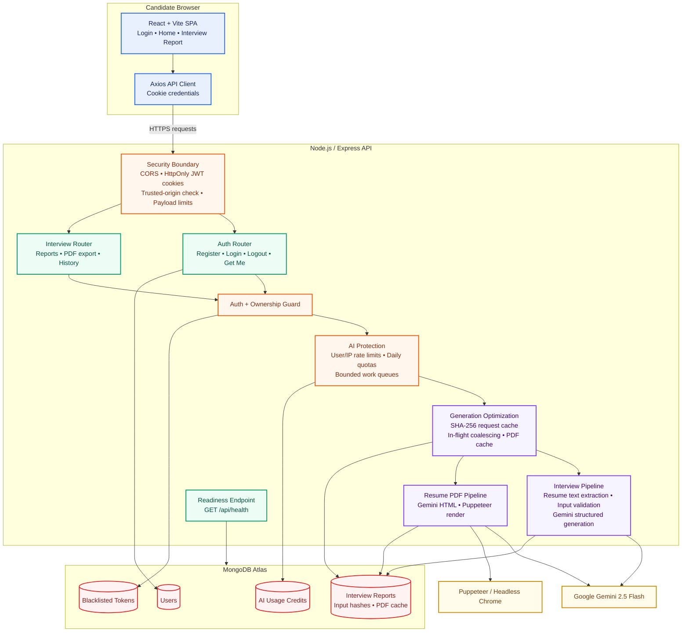

# CareerPilot AI

CareerPilot AI is a full-stack, AI-powered career-preparation platform. It transforms a candidate's resume or profile and a target job description into an interview-readiness report, including a match score, skill gaps, targeted questions, and a preparation roadmap. Users can also generate an ATS-oriented resume PDF from a saved report.

## Highlights

- Generate structured, role-specific interview reports with **Google Gemini 2.5 Flash**.
- Extract text from uploaded resumes with `pdf-parse`.
- Produce a match score, skill-gap analysis, technical and behavioral questions, and a day-wise preparation plan.
- Generate and cache resume PDFs with **Puppeteer** to avoid repeat rendering work.
- Provide an **ATS Intelligence Dashboard** with explainable requirement coverage, evidence mapping, section health, parsing signals, and safe resume-improvement actions.
- Reuse an existing report for identical candidate/job submissions through SHA-256 input hashing and in-flight request coalescing.
- Protect costly AI and PDF operations with per-user and per-IP rate limits, daily MongoDB-backed quotas, bounded queues, input limits, and rendering timeouts.
- Use secure JWT cookie authentication, token blacklisting, trusted-origin verification, CORS allowlists, and ownership-scoped data access.
- Load report history through cursor pagination and provide an API health endpoint for readiness monitoring.

---

## High-Level Architecture



### Request Flow

1. The React client sends an authenticated request with the candidate profile, job description, and optional resume upload.
2. Express applies CORS, trusted-origin, cookie, authentication, ownership, rate-limit, and payload-size checks.
3. For interview generation, the API checks the SHA-256 input hash. An existing report is returned immediately; matching in-flight requests share one generation job.
4. New work consumes a daily AI credit, enters the bounded Gemini queue, and persists the generated report to MongoDB.
5. For resume export, a cached PDF is returned when available. Otherwise, the API uses the bounded PDF queue, Gemini-generated HTML, and Puppeteer to render and cache the PDF.

---

## Core Components

| Layer | Components | Responsibility |
| --- | --- | --- |
| Frontend | React, React Router, Context API, SCSS, Framer Motion | Authentication UI, report creation, report history, PDF download, and interactive report view. |
| API | Node.js, Express, Axios-compatible REST endpoints | Routes requests, enforces security controls, and exposes application health. |
| AI | Google GenAI SDK, Zod, Zod-to-JSON-Schema | Requests schema-constrained Gemini outputs for interview reports and resume HTML. |
| ATS Intelligence | Deterministic analysis service, MongoDB snapshots | Explains job-requirement coverage without additional Gemini usage or automatic resume changes. |
| Document Processing | Multer, PDF-Parse, Puppeteer | Accepts resume uploads, extracts text, renders ATS-oriented PDF files, and caches generated output. |
| Data | MongoDB, Mongoose | Stores users, reports, cached PDFs, AI usage credits, and blacklisted tokens. |
| Protection | JWT, bcryptjs, CORS, rate limiting, queues | Secures sessions and controls AI/PDF cost and resource consumption. |

---

## Project Structure

```text
CareerPilot-AI/
├── backend/
│   ├── server.js                         # Starts only after MongoDB is ready
│   ├── src/
│   │   ├── app.js                        # Express app, CORS, health endpoint, error handling
│   │   ├── config/
│   │   │   ├── ai-usage.js               # AI rate, quota, queue, and input configuration
│   │   │   ├── database.js               # MongoDB connection and optional DNS configuration
│   │   │   └── security.js               # Cookie and trusted-origin configuration
│   │   ├── controllers/
│   │   │   ├── auth.controller.js
│   │   │   └── interview.controller.js
│   │   ├── middlewares/
│   │   │   ├── ai-rate-limit.middleware.js
│   │   │   ├── auth.middleware.js
│   │   │   ├── csrf.middleware.js
│   │   │   ├── file.middleware.js
│   │   │   └── rate-limit.middleware.js
│   │   ├── models/
│   │   │   ├── aiUsage.model.js
│   │   │   ├── blacklist.model.js
│   │   │   ├── interviewReport.model.js
│   │   │   └── user.model.js
│   │   ├── routes/
│   │   │   ├── auth.routes.js
│   │   │   └── interview.routes.js
│   │   └── services/
│   │       ├── ai.service.js             # Gemini and Puppeteer workflows
│   │       ├── ai-usage.service.js       # Persistent daily credits
│   │       ├── interview-cache.service.js# Duplicate generation avoidance
│   │       ├── report-pagination.service.js
│   │       └── work-queue.service.js     # Bounded Gemini/PDF work queues
│   └── test/                             # Node.js test suite
├── frontend/
│   └── src/
│       ├── features/auth/                # Login, registration, and auth state
│       ├── features/interview/           # Report creation, history, PDF download, views
│       ├── components/                   # Shared visual components
│       └── app.routes.jsx                # Application routes
└── README.md
```

---

## Technology Stack

### Backend

- Node.js and Express
- MongoDB and Mongoose
- Google GenAI SDK (`@google/genai`)
- Zod and Zod-to-JSON-Schema
- Puppeteer, PDF-Parse, and Multer
- JWT, bcryptjs, cookie-parser, and CORS

### Frontend

- React and Vite
- React Router
- Axios
- Context API
- SCSS and Framer Motion

---

## API Overview

| Method | Endpoint | Authentication | Description |
| --- | --- | --- | --- |
| `GET` | `/api/health` | No | Reports API/database readiness. |
| `POST` | `/api/auth/register` | No | Creates an account. |
| `POST` | `/api/auth/login` | No | Starts a secure cookie-based session. |
| `POST` | `/api/auth/logout` | Yes | Blacklists the current token and clears its cookie. |
| `GET` | `/api/auth/get-me` | Yes | Returns the current user. |
| `POST` | `/api/interview/` | Yes | Generates or reuses an interview report. |
| `GET` | `/api/interview/` | Yes | Returns cursor-paginated report history. |
| `GET` | `/api/interview/report/:interviewId` | Yes | Returns an ownership-scoped report. |
| `DELETE` | `/api/interview/report/:interviewId` | Yes | Deletes an ownership-scoped report. |
| `POST` | `/api/interview/resume/pdf/:interviewReportId` | Yes | Returns a cached or newly generated resume PDF. |
| `GET` | `/api/ats-analysis/:interviewReportId` | Yes | Returns the saved ATS analysis for an owned report. |
| `POST` | `/api/ats-analysis/:interviewReportId` | Yes | Creates or refreshes a deterministic ATS analysis. |
| `PATCH` | `/api/ats-analysis/:analysisId/suggestions/:suggestionId` | Yes | Saves the status of an ATS improvement suggestion. |

For history pagination, use `limit` (1–50; default 12) and the `nextCursor` returned by the previous response.

---

## Security, Reliability, and Cost Controls

- **Cookie security:** `httpOnly`, `secure`, `sameSite`, expiry, and matching logout-clear options are configured from environment variables.
- **Trusted browser requests:** CORS uses an allowlist and unsafe production requests require a trusted `Origin` header.
- **Ownership enforcement:** Report retrieval, deletion, and PDF export are scoped to the authenticated user.
- **AI abuse prevention:** Separate user/IP limits protect report and PDF endpoints; MongoDB-backed daily credits persist across restarts.
- **Input and rendering protection:** JSON and upload limits, character caps, Puppeteer request blocking, rendering timeout, and bounded queues prevent resource exhaustion.
- **Duplicate work prevention:** Input-hash lookup and in-flight coalescing avoid redundant Gemini calls; generated PDFs are cached with their report.
- **Explainable ATS analysis:** Requirement and evidence matching is deterministic, stored separately from the report, and never edits resume content automatically.
- **Operational readiness:** The server waits for MongoDB before listening and exposes `GET /api/health`.

> For multi-instance production deployments, use a shared rate-limit store such as Redis to make short-window request limits global across API instances.

---

## Getting Started

### Prerequisites

- Node.js 18 or later
- MongoDB Atlas account or local MongoDB instance
- Google Gemini API key

### 1. Clone

```bash
git clone https://github.com/Nihalani2004/CareerPilot-AI.git
cd CareerPilot-AI
```

### 2. Configure `backend/.env`

```env
PORT=3000
MONGO_URI=your_mongodb_connection_string
JWT_SECRET=use_a_long_random_secret
GOOGLE_GENAI_API_KEY=your_gemini_api_key
FRONTEND_URL=http://localhost:5173

NODE_ENV=development
JWT_EXPIRES_IN=1d

AUTH_COOKIE_MAX_AGE_MS=86400000
AUTH_COOKIE_SAME_SITE=lax
AUTH_COOKIE_SECURE=false

# Optional: use public resolvers if a local DNS server blocks MongoDB SRV lookups.
MONGODB_DNS_SERVERS=1.1.1.1,8.8.8.8

# AI usage defaults
AI_REPORT_RATE_LIMIT_WINDOW_MS=900000
AI_REPORT_RATE_LIMIT_MAX=3
AI_REPORT_IP_RATE_LIMIT_MAX=6
AI_REPORT_DAILY_LIMIT=10
AI_PDF_RATE_LIMIT_WINDOW_MS=900000
AI_PDF_RATE_LIMIT_MAX=5
AI_PDF_IP_RATE_LIMIT_MAX=10
AI_PDF_DAILY_LIMIT=10
AI_MAX_RESUME_CHARACTERS=15000
AI_MAX_JOB_DESCRIPTION_CHARACTERS=8000
AI_MAX_SELF_DESCRIPTION_CHARACTERS=4000
GEMINI_MAX_CONCURRENT=2
GEMINI_MAX_QUEUED=8
PUPPETEER_MAX_CONCURRENT=1
PUPPETEER_MAX_QUEUED=4
PUPPETEER_TIMEOUT_MS=30000
```

For production, use HTTPS with `NODE_ENV=production` and `AUTH_COOKIE_SECURE=true`. When the frontend is hosted on a different site, set `AUTH_COOKIE_SAME_SITE=none` together with `AUTH_COOKIE_SECURE=true`. Set `TRUST_PROXY=true` when TLS is terminated by a reverse proxy.

If the frontend calls a deployed API, add `VITE_API_BASE_URL=https://your-api.example.com` to `frontend/.env`. It defaults to `http://localhost:3000` for local development.

### 3. Install and Run

Start the backend:

```bash
cd backend
npm install
npm run dev
```

Start the frontend in another terminal:

```bash
cd frontend
npm install
npm run dev
```

Open `http://localhost:5173`.

### 4. Test

```bash
cd backend
npm test
```

---

## Notes on Performance

- Repeated identical submissions reuse the stored report instead of spending another Gemini generation.
- The report-history API uses cursor pagination and excludes resume text, question payloads, and cached PDF bytes from summary responses.
- A report-detail response excludes the cached PDF buffer; PDF bytes are sent only by the PDF download endpoint.
- Generated resume PDFs are stored with their report for fast repeat downloads.

---

## License

ISC
