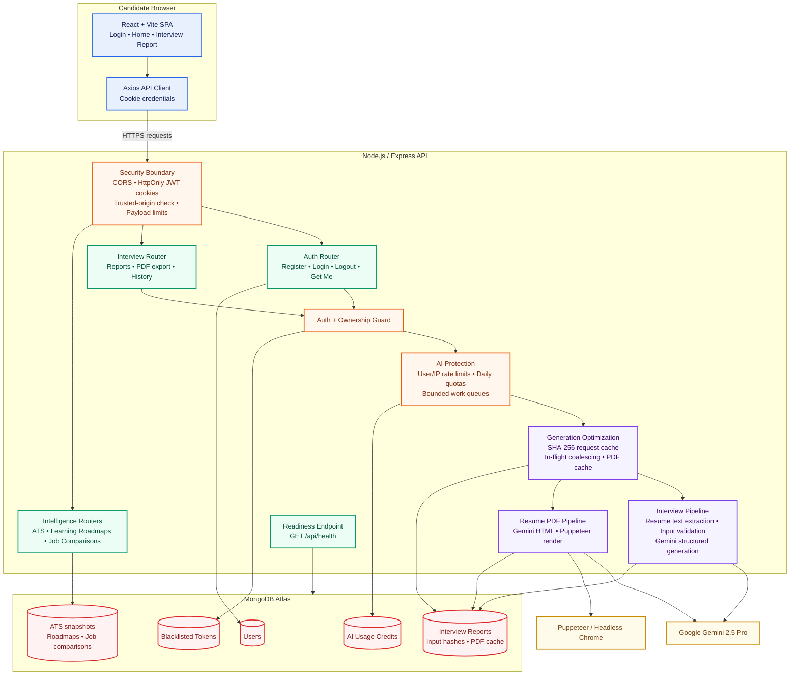

<div align="center">

# 🚀 CareerPilot AI

<hr />

### An Enterprise-Grade AI Career Readiness & Job Intelligence Platform

**ATS Intelligence • Personalized Learning Roadmaps • Job Market Comparison • AI Interview Strategy • ATS Resume Generation**

<br />


</div>

---

CareerPilot AI is a full-stack, AI-powered career-preparation platform. It transforms a candidate's resume or profile and a target job description into an interview-readiness report, including a match score, skill gaps, targeted questions, and a preparation roadmap. Users can also generate an ATS-oriented resume PDF from a saved report.

## Highlights

- Generate structured, role-specific interview reports with **Google Gemini 2.5 Pro**.
- Extract text from uploaded resumes with `pdf-parse`.
- Produce a match score, skill-gap analysis, technical and behavioral questions, and a day-wise preparation plan.
- Generate and cache resume PDFs with **Puppeteer** to avoid repeat rendering work.
- Provide an **ATS Intelligence Dashboard** with explainable requirement coverage, evidence mapping, section health, parsing signals, and safe resume-improvement actions.
- Turn AI-identified gaps into **Personalized Learning Roadmaps** with realistic weekly tasks, estimated effort, curated resources, progress tracking, and transparent interview-readiness progress.
- Compare 2-10 job descriptions in a separate **Job Market Comparison** workspace to surface repeated skills, high-demand tools, shared responsibilities, per-company requirement coverage, and profile-backed target-role readiness.
- Run a private **Resume ATS Checker** on PDF or DOCX files. It extracts resume text locally, evaluates parseability, structure, contact details, skills, chronology, achievement evidence, and formatting signals, then provides prioritized recommendations and version comparison.
- Reuse an existing report for identical candidate/job submissions through SHA-256 input hashing and in-flight request coalescing.
- Protect costly AI and PDF operations with per-user and per-IP rate limits, daily MongoDB-backed quotas, bounded queues, input limits, and rendering timeouts.
- Use secure JWT cookie authentication, token blacklisting, trusted-origin verification, CORS allowlists, and ownership-scoped data access.
- Support Google and GitHub OAuth with verified-email account linking, CSRF state validation, and the same secure JWT cookie session.
- Load report history through cursor pagination and provide an API health endpoint for readiness monitoring.

---

## High-Level Architecture



### Request Flow

1. The React client sends an authenticated request with the candidate profile, job description, and optional resume upload.
2. Express applies CORS, trusted-origin, cookie, authentication, ownership, rate-limit, and payload-size checks.
3. For interview generation, the API checks the SHA-256 input hash. An existing report is returned immediately; matching in-flight requests share one generation job.
4. New work consumes a daily AI credit, enters the bounded Gemini queue, and persists the generated report to MongoDB.
5. For resume export, a cached PDF is returned when available. Otherwise, the API uses the bounded PDF queue, Gemini-generated HTML, and Puppeteer to render and cache the PDF.

---

## Job Market Comparison Workflow

1. Open **Job Market Comparison** from the workspace menu, or use **Compare Job Market** from an interview report or ATS dashboard to link that report automatically.
2. Add 2-10 job descriptions for a target role, with optional company names and source URLs.
3. The deterministic comparison service identifies repeated skills, high-demand tools, and recurring responsibilities across the saved descriptions.
4. When a report is linked, the dashboard checks only the candidate's saved resume/profile evidence and presents an explainable target-role readiness score and gap map.
5. Comparisons are private to the authenticated user; adding, removing, or refreshing a description recalculates the stored analysis without consuming Gemini credits.

---

## Resume ATS Checker Workflow

1. Open **Resume ATS Checker** from the authenticated workspace menu and upload a PDF or DOCX resume (up to 3 MB).
2. The API extracts text with `pdf-parse` for PDFs or Mammoth for DOCX files, without consuming Gemini credits.
3. A deterministic readiness rubric evaluates file health, conventional section headings, contact signals, skills clarity, bullet structure, action language, measurable outcomes, and timeline readability.
4. The saved report presents score breakdowns, parser evidence, prioritized fixes, and a three-item **Recommended Focus** plan with concrete actions.
5. Users can return to their private scan history, compare two saved versions, or delete an individual scan. Identical files reuse the matching analysis-version cache.

> This is an explainable ATS-readiness estimate, not a hiring prediction or a score from an employer's proprietary ATS. For role-specific alignment, use ATS Intelligence with a target job description.

---

## Core Components

| Layer | Components | Responsibility |
| --- | --- | --- |
| Frontend | React, React Router, Context API, SCSS, Framer Motion | Authentication UI, report creation, report history, PDF download, and interactive report view. |
| API | Node.js, Express, Axios-compatible REST endpoints | Routes requests, enforces security controls, and exposes application health. |
| AI | Google GenAI SDK, Zod, Zod-to-JSON-Schema | Requests schema-constrained Gemini outputs for interview reports and resume HTML. |
| ATS Intelligence | Deterministic analysis service, MongoDB snapshots | Explains job-requirement coverage without additional Gemini usage or automatic resume changes. |
| Learning Roadmaps | Deterministic planning and readiness services, MongoDB tasks | Turns report-grounded gaps into weekly tasks, curated resources, progress tracking, and transparent readiness progress. |
| Job Market Comparison | Deterministic comparison service, MongoDB snapshots | Compares 2-10 role descriptions, identifies market demand, and checks a linked report for profile evidence without another Gemini request. |
| Resume ATS Checker | Deterministic rubric, MongoDB versioned scans | Analyzes PDF/DOCX resume structure and evidence, returns focused improvement actions, and compares saved scan versions without Gemini usage. |
| Document Processing | Multer, PDF-Parse, Mammoth, Puppeteer | Accepts PDF/DOCX resume uploads, extracts text, renders ATS-oriented PDF files, and caches generated output. |
| Data | MongoDB, Mongoose | Stores users, reports, cached PDFs, AI usage credits, and blacklisted tokens. |
| Protection | JWT, bcryptjs, CORS, rate limiting, queues | Secures sessions and controls AI/PDF cost and resource consumption. |

---

## Project Structure

```text
CareerPilot-AI/
├── backend/
│   ├── server.js                         # Starts only after MongoDB is ready
│   ├── src/
│   │   ├── app.js                        # Express app, CORS, health endpoint, error handling
│   │   ├── config/
│   │   │   ├── ai-usage.js               # AI rate, quota, queue, and input configuration
│   │   │   ├── database.js               # MongoDB connection and optional DNS configuration
│   │   │   └── security.js               # Cookie and trusted-origin configuration
│   │   ├── controllers/
│   │   │   ├── auth.controller.js
│   │   │   └── interview.controller.js
│   │   ├── middlewares/
│   │   │   ├── ai-rate-limit.middleware.js
│   │   │   ├── auth.middleware.js
│   │   │   ├── csrf.middleware.js
│   │   │   ├── file.middleware.js
│   │   │   └── rate-limit.middleware.js
│   │   ├── models/
│   │   │   ├── aiUsage.model.js
│   │   │   ├── blacklist.model.js
│   │   │   ├── interviewReport.model.js
│   │   │   └── user.model.js
│   │   ├── routes/
│   │   │   ├── auth.routes.js
│   │   │   └── interview.routes.js
│   │   └── services/
│   │       ├── ai.service.js             # Gemini and Puppeteer workflows
│   │       ├── ai-usage.service.js       # Persistent daily credits
│   │       ├── interview-cache.service.js# Duplicate generation avoidance
│   │       ├── report-pagination.service.js
│   │       └── work-queue.service.js     # Bounded Gemini/PDF work queues
│   └── test/                             # Node.js test suite
├── frontend/
│   └── src/
│       ├── features/auth/                # Login, registration, and auth state
│       ├── features/interview/           # Report creation, history, PDF download, views
│       ├── components/                   # Shared visual components
│       └── app.routes.jsx                # Application routes
└── README.md
```

Key feature modules added to the current structure:

- `backend/src/controllers/jobComparison.controller.js`, `models/jobComparison.model.js`, `routes/jobComparison.routes.js`, and `services/job-comparison.service.js`
- `backend/src/controllers/learningRoadmap.controller.js`, roadmap/task models, routes, and deterministic planning/readiness services
- `frontend/src/features/job-comparison/` for the comparison library, builder, dashboard, and API client
- `frontend/src/features/roadmaps/` for roadmap creation, saved-plan views, weekly tasks, resources, and progress tracking
- `backend/src/controllers/resumeAts.controller.js`, `models/resumeAtsScan.model.js`, `routes/resumeAts.routes.js`, and `services/resume-ats.service.js` for private ATS scan creation, scoring, recommendations, and version comparison
- `frontend/src/features/resume-ats/` for the centered uploader, analysis progress state, saved scan library, report, recommendations, and version comparison UI
- `frontend/src/components/WorkspaceMenu.jsx` for the authenticated workspace navigation

---

## Technology Stack

### Backend

- Node.js and Express
- MongoDB and Mongoose
- Google GenAI SDK (`@google/genai`)
- Zod and Zod-to-JSON-Schema
- Puppeteer, PDF-Parse, Mammoth, and Multer
- JWT, bcryptjs, cookie-parser, and CORS

### Frontend

- React and Vite
- React Router
- Axios
- Context API
- SCSS and Framer Motion

---

## API Overview

| Route group | Authentication | Purpose |
| --- | --- | --- |
| `GET /api/health` | No | API and database readiness. |
| `/api/auth/*` | Mixed | Register, login, OAuth, logout, and current-user session. |
| `/api/interview/*` | Yes | Create, reuse, view, list, delete, and export interview reports. |
| `/api/ats-analysis/*` | Yes | Create and view deterministic ATS intelligence for a saved report. |
| `/api/learning-roadmaps/*` | Yes | Create, view, and update personalized learning plans and task progress. |
| `/api/job-comparisons/*` | Yes | Create, view, update, analyze, and manage private job-description comparisons. |
| `/api/resume-ats/scans*` | Yes | Create a private PDF/DOCX resume scan, list/view/delete saved scans, and compare two versions. |

See the route files under `backend/src/routes/` for the complete endpoint contract. Report and comparison libraries use cursor pagination with `limit` and `nextCursor`.

---

## Security, Reliability, and Cost Controls

- **Cookie security:** `httpOnly`, `secure`, `sameSite`, expiry, and matching logout-clear options are configured from environment variables.
- **Trusted browser requests:** CORS uses an allowlist and unsafe production requests require a trusted `Origin` header.
- **Ownership enforcement:** Report retrieval, deletion, and PDF export are scoped to the authenticated user.
- **AI abuse prevention:** Separate user/IP limits protect report and PDF endpoints; MongoDB-backed daily credits persist across restarts.
- **Input and rendering protection:** JSON and upload limits, character caps, Puppeteer request blocking, rendering timeout, and bounded queues prevent resource exhaustion.
- **Duplicate work prevention:** Input-hash lookup and in-flight coalescing avoid redundant Gemini calls; generated PDFs are cached with their report.
- **Explainable ATS analysis:** Requirement and evidence matching is deterministic, stored separately from the report, and never edits resume content automatically.
- **Private resume scans:** Resume ATS uploads are capped at 3 MB, accept only PDF/DOCX files, are user-scoped, rate-limited, and store extracted-analysis results rather than the original uploaded file.
- **Private market intelligence:** Job comparisons are ownership-scoped, accept bounded input (2-10 descriptions, 8,000 characters each), detect duplicate descriptions by normalized hash, and refresh deterministically without additional AI usage.
- **Operational readiness:** The server waits for MongoDB before listening and exposes `GET /api/health`.

> For multi-instance production deployments, use a shared rate-limit store such as Redis to make short-window request limits global across API instances.

---

## Getting Started

### Prerequisites

- Node.js 18 or later
- MongoDB Atlas account or local MongoDB instance
- Google Gemini API key

### 1. Clone

```bash
git clone https://github.com/Nihalani2004/CareerPilot-AI.git
cd CareerPilot-AI
```

### 2. Configure `backend/.env`

```env
PORT=3000
MONGO_URI=your_mongodb_connection_string
JWT_SECRET=use_a_long_random_secret
GOOGLE_GENAI_API_KEY=your_gemini_api_key
GEMINI_MODEL=gemini-2.5-pro
FRONTEND_URL=http://localhost:5173
```

These values are sufficient for the core application. Cookie security, AI limits, queues, and input limits have safe defaults in code. You can override `GEMINI_MODEL` later if your deployment needs a different performance or cost profile.

If the frontend calls a deployed API, add `VITE_API_BASE_URL=https://your-api.example.com` to `frontend/.env`. It defaults to `http://localhost:3000` for local development.

### OAuth provider setup

OAuth is optional. Enable it only when Google or GitHub sign-in is needed:

```env
BACKEND_URL=http://localhost:3000
GOOGLE_OAUTH_CLIENT_ID=your_google_client_id
GOOGLE_OAUTH_CLIENT_SECRET=your_google_client_secret
GITHUB_OAUTH_CLIENT_ID=your_github_client_id
GITHUB_OAUTH_CLIENT_SECRET=your_github_client_secret
```

Create a Google OAuth 2.0 web client and a GitHub OAuth App, then configure these callback URLs exactly:

```text
http://localhost:3000/api/auth/oauth/google/callback
http://localhost:3000/api/auth/oauth/github/callback
```

For deployment, replace `http://localhost:3000` with the value of `BACKEND_URL`, use HTTPS, and register the production callback URL with both providers. OAuth users must provide a verified provider email; existing password accounts with that verified email are linked automatically.

### 3. Install and Run

Start the backend:

```bash
cd backend
npm install
npm run dev
```

Start the frontend in another terminal:

```bash
cd frontend
npm install
npm run dev
```

Open `http://localhost:5173`.

### 4. Test

```bash
cd backend
npm test
```

---

## Notes on Performance

- Repeated identical submissions reuse the stored report instead of spending another Gemini generation.
- The report-history API uses cursor pagination and excludes resume text, question payloads, and cached PDF bytes from summary responses.
- A report-detail response excludes the cached PDF buffer; PDF bytes are sent only by the PDF download endpoint.
- Generated resume PDFs are stored with their report for fast repeat downloads.
- Resume ATS scans are versioned by content hash and scoring version, so updated scoring rules do not silently reuse an older result.

---

## License

ISC
